<!-- ===================== BANNER 1 — LAUNCH ===================== -->

  

<!-- ===================== TYPING ===================== -->

  

<h2 align="center">🚀 Welcome aboard — Follow the flight down the page 🪐</h2>

<!-- ===================== SOCIALS (icon-only) + VIEWS ===================== -->

  
  
  
  
  
  
  
  
    
  

 

<!-- ===================== SNAKE (contributions, blue palette) ===================== -->

  <picture>
    <source media="(prefers-color-scheme: dark)" srcset="https://raw.githubusercontent.com/JANITH44/JANITH44/output/github-contribution-grid-snake-dark.svg" />
    <source media="(prefers-color-scheme: light)" srcset="https://raw.githubusercontent.com/JANITH44/JANITH44/output/github-contribution-grid-snake.svg" />
    
  </picture>

---

<!-- ===================== BANNER 2 — ASTEROID FIELD ===================== -->

  

<h2 align="center">🛠️ TECH STACK 🛠️</h2>

  
  
  
  
  
  
  

---

<!-- ===================== BANNER 3 — NEBULA ===================== -->

  

<h2 align="center">🌠 FEATURED PROJECTS 🌠</h2>

| 🚀 Project | 🛰️ Stack | 📡 Status | 🔗 Link |
|:---|:---|:---:|:---:|
| **Project One** — short one-line description here |   |  | [Repo](https://github.com/JANITH44) |
| **Project Two** — short one-line description here |  |  | [Repo](https://github.com/JANITH44) |
| **Project Three** — short one-line description here |    |  | [Repo](https://github.com/JANITH44) |

*(swap in your real project names, descriptions, and repo links — just edit this table)*

---

<!-- ===================== BANNER 4 — ARRIVAL AT BASE ===================== -->

  

<h2 align="center">⚡ MY STATS ⚡</h2>

  
  

  

---

<h2 align="center">🌌 CONTRIBUTIONS 🌌</h2>

  

  

   
  

